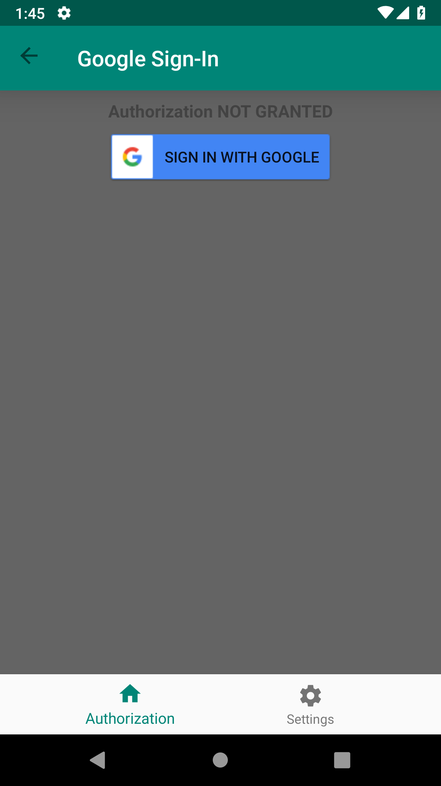
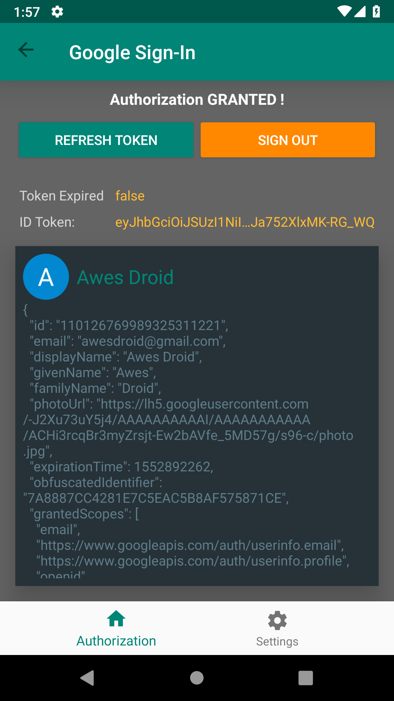
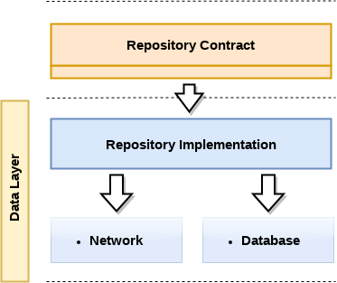

# AwesAuthKt

[](https://kotlinlang.org/)  [](https://opensource.org/licenses/Apache-2.0)


This app is a demonstration of using [AppAuth for Android](https://github.com/openid/AppAuth-Android) and
[Google Sign-In for Android](https://developers.google.com/identity/sign-in/android/start) for OAuth2
and authentication.

<div align:left;display:inline;>





</div>

### Architecture
This app implements the [Clean Architecture](https://blog.cleancoder.com/uncle-bob/2012/08/13/the-clean-architecture.html) proposed by Robert C. Martin (Uncle Bob)


As of Android, it's inspired by an implementation from `Fernando Cejas's` repo [Android-CleanArchitecture-Kotlin](https://github.com/android10/Android-CleanArchitecture-Kotlin)

#### Android 3 Layers Architecture


#### Presentation Layer


#### Data Layer


### Adaption for This App
Since `AppAuth for android` and `Google SignIn` have both heavily relied on Android (Activity, Context, Uri, 
...), it is impossible to put their logic in `Domain layer`. Therefore I replace `Repository Contact` with `AuthDelegate`
to delegate business logic in `Data layer` and keep `Domain layer` a pure Kotlin library

### Achievements
- Clean Architecture + MVVM
- AppAuth for Android client implementation
- Google SignIn client implementation
- Coroutines
- Kodein for DI
- JUnit Test for database with RobolectricTest + Mockito + JUnit
- Android Instrumentation Test for database

### TO DO LIST
- JUnit Test for UI (It might be hard to do because `AppAuth` and `Google SignIn` use external Chrome to do authorization and authentication,
 it's hard to simulate user log in actions)

### AppAuth for Android
The app uses Google OAuth2 configuration `google_config.json`. To run it on your own, you have to
create a configuration json as the `res/raw/xxx.json`
```json
{
  "client_id": "YOUR CLIENT ID REGISTERED IN YOUR OAUTH2 PROVIDER",
  "redirect_uri": "XXX.XXX:/",
  "authorization_scope": "openid email profile",
  "discovery_uri": "YOUR OAUTH2 PROVIDER'S URI TO FETCH DISCOVERY DOCUMENT ",
  "authorization_endpoint_uri": "YOUR OAUTH2 PROVIDER'S ENDPOINT FOR AUTHORIZATION",
  "token_endpoint_uri": "YOUR OAUTH2 PROVIDER'S ENDPOINT FOR TOKEN",
  "registration_endpoint_uri": "xxx",
  "user_info_endpoint_uri": "YOUR OAUTH2 PROVIDER'S ENDPOINT FOR USER INFO",
  "https_required": true
}
```

> NOTE: `redirect_uri` is exclusive with `authorization_endpoint_uri`, `token_endpoint_uri` and
`user_info_endpoint_uri`

### Google Sign-In for Android
The only need to run it is to place you client id in `res/raw/google_signin.json` like this
```json
{
  "client_id": "YOUR CLIENT ID REGISTERED IN YOUR OAUTH2 PROVIDER"
}
```


## License
Copyright Awesdroid 2019

This file is part of some open source application.

Licensed to the Apache Software Foundation (ASF) under one or more contributor license agreements. See the NOTICE file distributed with this work for additional information regarding copyright ownership. The ASF licenses this file to you under the Apache License, Version 2.0 (the "License"); you may not use this file except in compliance with the License. You may obtain a copy of the License at

http://www.apache.org/licenses/LICENSE-2.0

Unless required by applicable law or agreed to in writing, software distributed under the License is distributed on an "AS IS" BASIS, WITHOUT WARRANTIES OR CONDITIONS OF ANY KIND, either express or implied. See the License for the specific language governing permissions and limitations under the License.

Contact: awesdroid@gmail.com